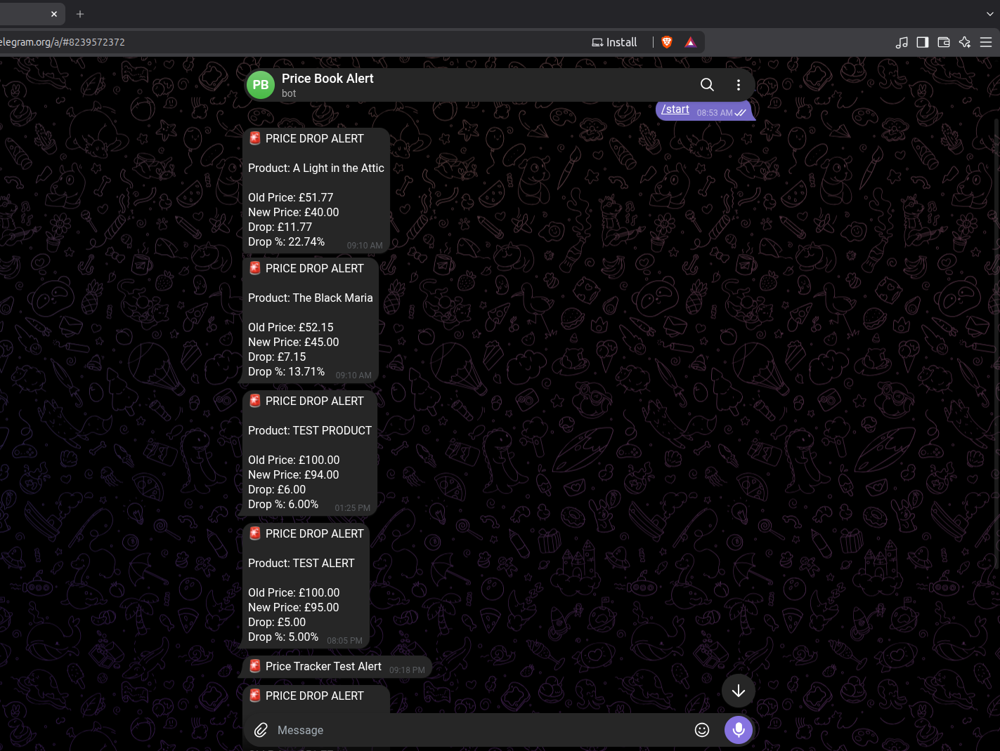

# Price Tracker & Telegram Alert System

**A Python-based product price tracking system that monitors product prices, stores price history in SQLite, detects significant price drops, and sends Telegram alerts automatically.**

## Features

- **Product price scraping**
- **SQLite price-history database**
- **Automatic price-drop detection**
- **Configurable drop threshold**
- **Telegram notifications**
- **Duplicate alert prevention**
- **Automatic execution using Linux Cron**
- **Price and availability tracking**
- **Logging for scraper and tracker**


## Project Flow

```text
Product Website
      ↓
   Scraper
      ↓
 SQLite Database
      ↓
 Price Tracker
      ↓
 Price Drop Detection
      ↓
 Telegram Alert
      ↓
 User

```
##  Project Structure 

```text
 price-tracker/
│
├── scraper.py        # Scrapes product information
├── tracker.py        # Detects price drops and sends alerts
├── runner.py         # Runs scraper + tracker
├── price_tracker.db  # SQLite database
├── tracker.log       # Tracker logs
├── cron.log          # Cron execution logs
├── .env              # Telegram configuration
├── .gitignore
└── README.md

```

## Requirements
- **Python 3**
- **pip**
- **SQLite**
- **Linux/macOS**
- **Telegram Bot**

## Price Drop Detection
**The system calculates:**  
  **Drop Amount = Old Price - New Price**

**A Telegram alert is generated when the price drop reaches the configured threshold.**

## Telegram Alert
Example:
🚨 PRICE DROP ALERT

Product: TEST ALERT

- **Old Price: ₹100.00**
- **New Price: ₹95.00**
- **Drop: ₹5.00**
- **Drop %: 5.00%**
  
## Telegram Alert

The system automatically sends a Telegram notification when a significant price drop is detected.



## Database

The project uses SQLite to store:

- **Product title**
- **Price**
- **Availability**
- **Scraping timestamp**
- **Previous price**
- **New price**
- **Price-drop amount**
- **Price-drop percentage**
- **Alert timestamp**

## Technologies Used

- **Python**
- **SQLite**
- **Pandas**
- **Requests / Web Scraping**
- **Telegram Bot API**
- **Linux Cron**
- **Git**

## Future Improvements

- **Multiple product support**
- **Web dashboard**
- **Price charts**
- **Email notifications**
- **WhatsApp notifications**
- **Multiple Telegram users**
- **Historical price analytics**
- **Docker deployment**
- **Cloud deployment**

## Author

**Built as a Python automation project for real-world price monitoring and notification.**
